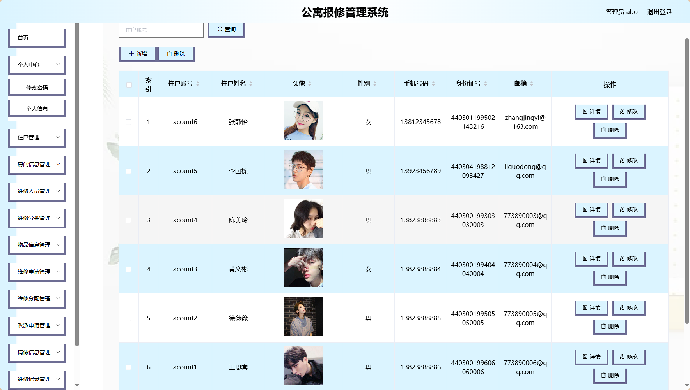
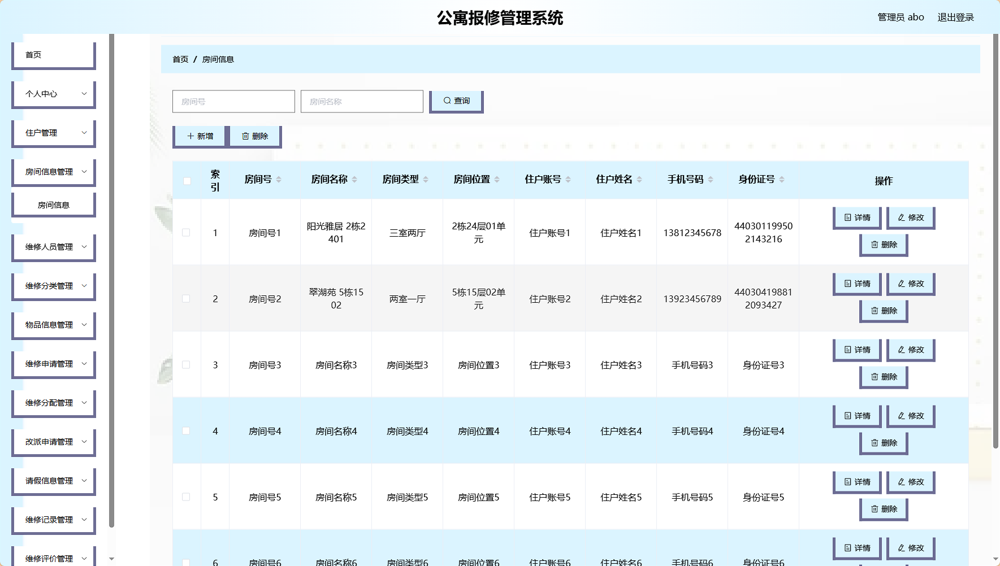
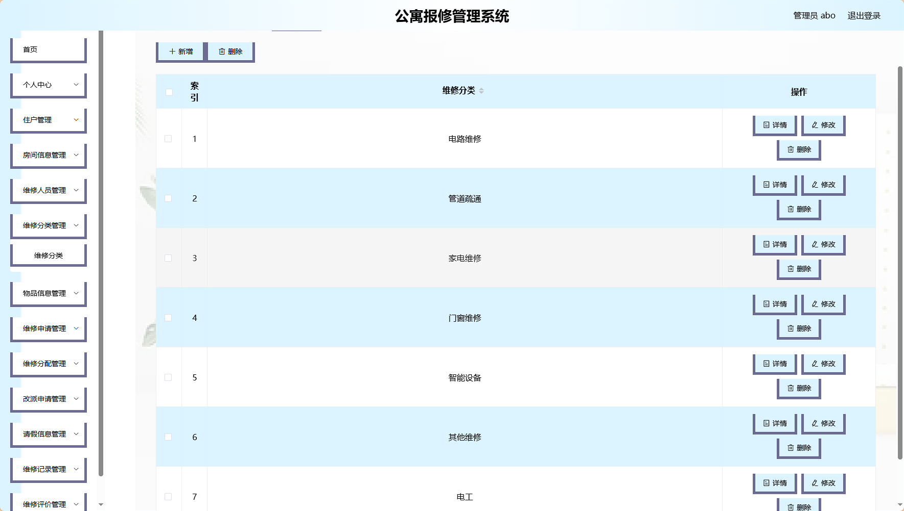
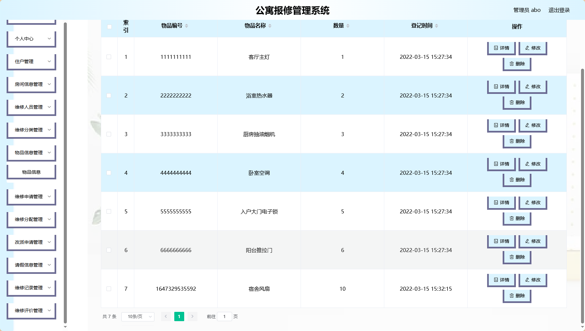
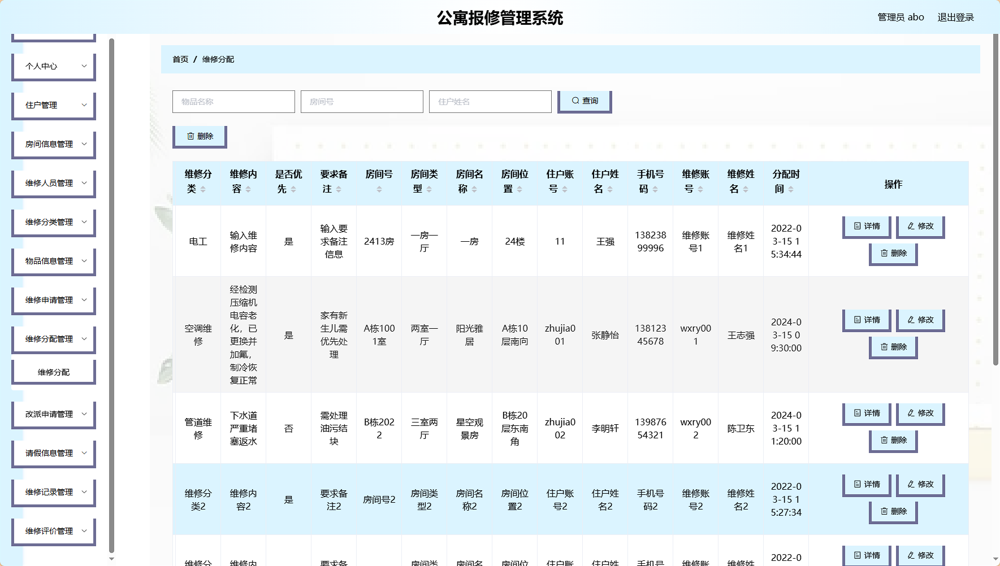

# springboot019-基于java的公寓报修管理系统 / springboot-Apartment_Repair_Management


> 更多毕设项目可跳转至项目导航栏检索：[毕设项目](http://sysadmin.3vfree.vip)，需要联系博主v：xq-lucky311，q：1047944234. 备注：项目咨询注：由于前端项目太大，仅上传了后端代码，未包含前端代码...

## 项目简介  
基于SpringBoot + MyBatis-Plus + Shiro的公寓维修管理系统，支持住户报修申请、维修任务分配、费用结算和评价反馈，包含管理员审核、数据统计及多端交互功能。

## 特征介绍  
- **权限控制**：集成Shiro实现管理员/住户/维修员三级权限体系，支持动态路由拦截  
- **高效开发**：MyBatis-Plus代码生成器自动创建entity/mapper/service层代码  
- **文件管理**：内置FileUtil工具类支持图片上传/下载，OSS文件存储对接  
- **数据安全**：MD5加密存储用户密码，Token机制保持会话状态  
- **智能验证**：通过BaiduUtil集成文字识别能力，支持证件信息自动核验  
- **报表生成**：POI组件实现维修记录导出Excel，支持.xls/.xlsx双格式  

## 代码结构
```
src/
├── main/
│   ├── java/
│   │   ├── com/
│   │   │   ├── annotation/          # 权限注解
│   │   │   │   ├── IgnoreAuth.java
│   │   │   ├── config/              # 系统配置
│   │   │   │   ├── MybatisPlusConfig.java
│   │   │   ├── controller/          # 接口层
│   │   │   │   ├── FangjianxinxiController.java
│   │   │   │   ├── GaipaishenqingController.java
│   │   │   ├── entity/              # 数据模型
│   │   │   │   ├── model/           # 业务对象
│   │   │   │   ├── view/            # 视图对象  
│   │   │   ├── service/             # 服务层
│   │   │   │   ├── impl/            # 实现类
│   │   │   ├── utils/               # 工具包
│   │   │   │   ├── FileUtil.java    # 文件处理
│   ├── resources/
│   │   ├── mapper/                  # SQL映射
│   │   ├── application.yml          # 主配置
│   │   ├── static/                  # 静态资源
│   │   │   ├── upload/              # 文件存储
```
## 使用说明
1. 启动MySQL服务（5.7+）
2. 修改application.yml中数据库连接配置
3. 访问后台：http://localhost:8080/springboot3lx4p/admin/dist/index.html
4. 使用管理员账号：abo/abo
```

# 项目实际截图：
## 登录：


## 后台：








> 等等...

# 精选项目导航 & 快速部署工具
## 项目资源一站直达
- ​**访问项目导航站**：[点击进入](http://sysadmin.3vfree.vip)**快速检索所需项目名称**
- ​**技术栈全覆盖**：Java/SSm/Spring Boot/小程序等主流技术方案
- ​**配套资源**：每个项目均提供部署文档 + 演示视频（附效果截图）

### ▌导航站预览


### ▌工具界面预览


## 捐赠
> 博主将持续更新Java全栈开发项目，包含ssm，springboot，前后端分离系统等项目。
> 此外如果您够宽裕，请博主喝杯咖啡吧！捐赠将用于服务器维护与开源社区建设，感谢您的认可！
> 如需更多Java相关项目毕设3000+，有其他项目需求，sql文件等可联系博主v:xq-lucky311

---